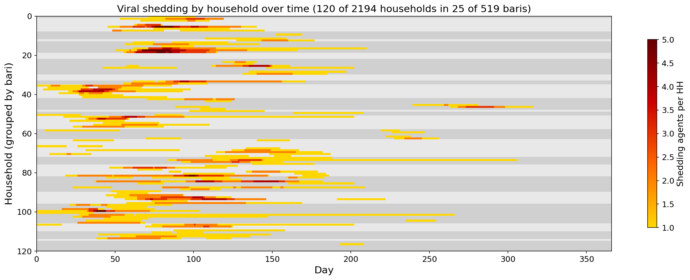
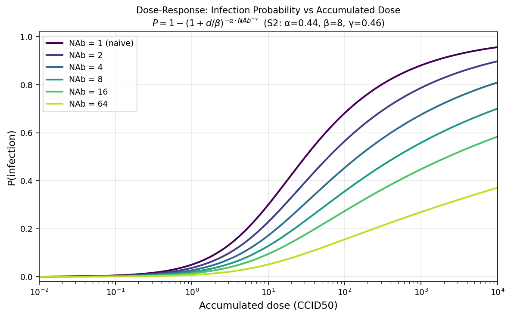
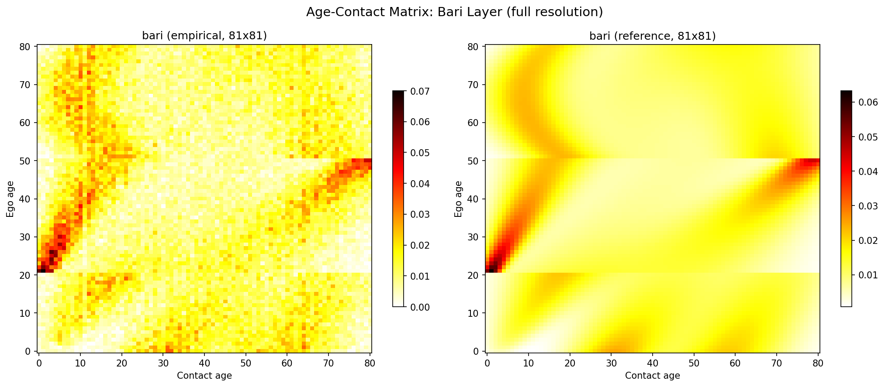
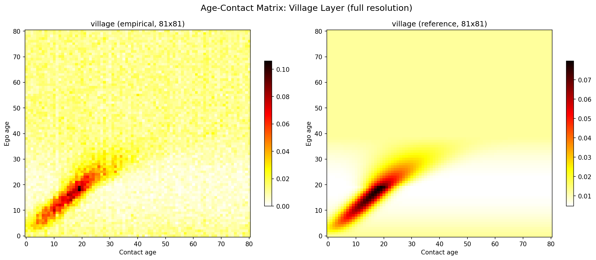
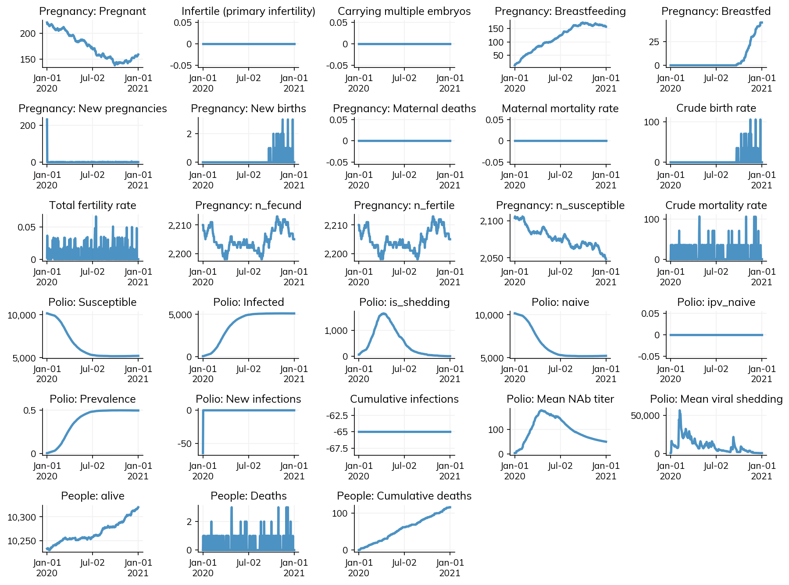

# Polio dose-response transmission in Starsim

Starsim's built-in transmission model computes infection probability per contact as `beta * rel_trans * rel_sus`. This works well for many diseases, but fecal-oral pathogens like polio are different: an individual accumulates viral dose from *all* their contacts throughout the day, and then a nonlinear dose-response function — modulated by host immunity — determines whether infection occurs. We ported [Wong & Famulare's multiscale polio community-structure model](https://github.com/InstituteforDiseaseModeling/community-structure-mediates-polio-transmission) into [Starsim](https://github.com/starsimhub/starsim), creating the framework's first dose-response transmission class.



<!-- more -->

## The reference model

Mike Famulare and Wesley Wong built a multiscale agent-based model for Sabin 2 poliovirus transmission in Bangladesh, described in *"Multiscale model for forecasting Sabin 2 vaccine virus household and community transmission"*. The model captures community structure at three nested scales — households within *baris* (neighborhood compounds) within villages — with age-assortative mixing at each level. Transmission is driven by a dose-response function where viral shedding accumulates across contacts and immunity modulates susceptibility through a Hill-equation-style curve.

The original Python implementation lives at [InstituteforDiseaseModeling/community-structure-mediates-polio-transmission](https://github.com/InstituteforDiseaseModeling/community-structure-mediates-polio-transmission). Our Starsim port is at [starsimhub/starsim-community-structure](https://github.com/starsimhub/starsim-community-structure).

## Dose-response in Starsim

The core challenge: Starsim's `Infection.step()` processes each network edge independently — `P = beta * rel_trans * rel_sus`. But for dose-response, we need to *accumulate* dose across all edges first, then apply a nonlinear function once per person. This required a new base class, `DoseResponseInfection`, that overrides the transmission step.

The dose-response formula from the reference model:

$$
P(\text{infection} \mid d, \text{NAb}) = 1 - \left(1 + \frac{d}{\beta_s}\right)^{-\alpha \cdot \text{NAb}^{-\gamma}}
$$

where $d$ is accumulated dose, $\beta_s$ is a strain-specific scale parameter, $\alpha$ controls the shape, and $\gamma$ controls how immunity dampens susceptibility. Higher NAb (neutralizing antibody) immunity flattens the curve — you need exponentially more dose to infect.



The transmission step has two phases. First, **accumulate dose** from all networks using `np.add.at` (which safely handles multiple edges to the same person):

```python
def accumulate_dose(self):
    self.challenge_dose[:] = 0.0
    for network in self.sim.networks.values():
        p1, p2, beta_edge = network.edges.p1, network.edges.p2, network.edges.beta
        scale = self.pars.beta * self.pars.fecal_oral_dose
        np.add.at(dose_raw, p1, scale * beta_edge * rel_trans_raw[p2])
        np.add.at(dose_raw, p2, scale * beta_edge * rel_trans_raw[p1])
```

Then, **challenge susceptibles** using the dose-response function. Each person's infection probability is computed from their total accumulated dose and current immunity:

```python
@staticmethod
def infection_prob_func(module, sim, uids):
    dose = module.challenge_dose[uids]
    nab = module.immunity_nab[uids]
    p = module.pars
    return 1 - (1 + dose / p.beta_scale) ** (-p.alpha * nab ** (-p.gamma))
```

This function is passed to `ss.bernoulli(p=infection_prob_func)`, which Starsim evaluates per-agent — each susceptible person rolls against their individual infection probability. Because dose is summed linearly before the nonlinear transform, it doesn't matter whether you get dose 10 from one contact or dose 5 from two — the total dose is the same. What the nonlinearity *does* capture is that infection probability saturates at high dose (diminishing returns) and that immunity reshapes the entire curve rather than simply scaling it.

## In-host dynamics

The within-host biology is faithfully ported from the reference model:

**Immunity waning** uses power-law decay (not exponential): $\text{NAb}(t) = \text{NAb}_{\text{peak}} \cdot (t/30)^{-r}$. This distinction matters for OPV reversion epidemiology — power-law decay has a long tail where immunity remains above baseline for years, unlike exponential decay which rapidly returns to zero.

**Shedding intensity** varies with time since infection, age, and immunity. Infants shed at peak concentrations of $10^{6.7}$ CCID50/g while adults peak at $10^{4.3}$, and pre-existing immunity further reduces the peak. The temporal profile follows a log-normal-in-time shape:

```python
predicted = (10**peak_cid50) * np.exp(
    eta - 0.5 * v**2 - (log_term**2) / (2 * variance**2)
) / t_days
self.viral_shed[uids] = np.maximum(shed_min, predicted)
```

**Shedding duration** is immunity-dependent and lognormally distributed — higher pre-challenge immunity shortens shedding. The model supports four poliovirus strains (S1, S2, S3, WPV) with strain-specific parameters for $\beta_s$, shedding duration, and variance.

## Multi-scale network

The reference model's network operates at three scales: household, bari (neighborhood), and village. A key insight from the reference implementation: **contacts are only generated FROM infectious agents**, not from the entire population. In the original code, `Transmission` objects are created only for shedding individuals, and these drive contact sampling at each scale.

We replicated this pattern in Starsim by having `BariNet` and `VillageNet` check the disease module's `is_shedding` state in `add_pairs()`. Our initial implementation generated contacts for *all* agents every timestep, which was faithful but slow — O(n_agents) per step. Switching to infectious-only contact generation brought this down to O(n_infectious), matching the reference model's design and cutting runtime from minutes to seconds. Both the reference model and our port run at `dt = 1 day`, with contacts sampled fresh each timestep — no persistent edges. In Starsim, this is achieved by setting `dur=0` on bari/village edges. (Starsim does support persistent edges with `dur > 0` if longer-lasting contact relationships are needed for other applications.)

At each scale, contacts are sampled with age-weighted probabilities from 81x81 age-mixing matrices. The bari layer uses a 3-Gaussian mixture (capturing multi-generational household structure), while the village layer uses a 1-Gaussian + uniform background model. Here are the empirical sampling distributions compared to the reference matrices:





The three layers are mutually exclusive: household handles within-household, bari handles within-bari excluding own household, and village handles between-bari contacts.

## Results

The full model runs 1000 agents over 2 years in ~4 seconds — fast enough for interactive exploration. Here's a sample epidemic with Sabin type 2:



## What's Next

- **Generalize `DoseResponseInfection` into Starsim core** — the base class is disease-agnostic and could support cholera, norovirus, rotavirus, and other fecal-oral pathogens
- **CRN-safe networks** — we explored several approaches (1D CDF embedding, multi-pass per-Gaussian, seeker/target interleaving) but found that nearest-neighbor matching in small baris (~50 agents) doesn't produce sufficient age structure. This remains an open design challenge.
- **Realistic demographics** — replace synthetic DHS data with actual household composition data from Bangladesh

Code: [starsimhub/starsim-community-structure](https://github.com/starsimhub/starsim-community-structure)
